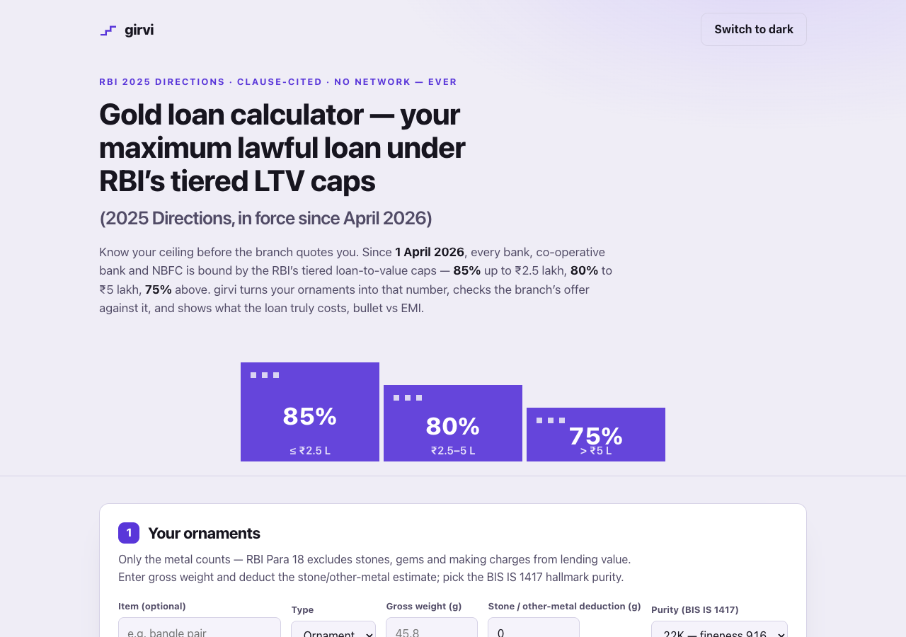

# girvi — gold loan calculator: your maximum lawful loan under RBI's tiered LTV caps

**Know your ceiling before the branch quotes you.** Since 1 April 2026 every bank,
co-operative bank and NBFC in India is bound by the tiered loan-to-value caps of the
**Reserve Bank of India (Lending Against Gold and Silver Collateral) Directions, 2025**
(RBI/2025-26/47, issued 6 June 2025). Gold-loan borrowers today hear only the branch's
"per gram" number with the RBI LTV math hidden. girvi does that math in the open —
clause-cited, offline, on your device.

**Live:** https://sreenivas-sadhu-prabhakara.github.io/girvi/



## What it does

- **Ornament valuation** — gross weight minus stone/other-metal deduction = net metal;
  BIS IS 1417 purity picker (585 / 750 / 833 / 916 / 958 / 995); you **type** the 22K
  reference rate per gram. No live rate, by design — the no-network CSP is the guarantee.
- **The tiered ceiling** — a piecewise engine solves the circular tier boundary (the cap
  depends on the loan, which depends on the cap): 85% up to ₹2.5 lakh, 80% to ₹5 lakh,
  75% above — including both **plateau zones** (≈ ₹2.94–3.13 L and ₹6.25–6.67 L of
  collateral value) where more gold does not raise the ceiling, with plain-language copy.
- **Branch-offer check** — type the amount offered → *within* or *above* the legal cap.
  The ceiling is a negotiation maximum and legality check, never an entitlement.
- **True cost, bullet vs EMI** — bullet total repayable (simple interest, a labelled and
  editable assumption) beside the closed-form EMI; the bullet card re-checks the
  repayable-at-maturity amount against the cap (Para 6(v)) and warns past the 12-month
  bullet tenor limit (Para 15).
- **Margin-call headroom** — the % fall in the reference price at which the loan breaches
  the cap that must hold throughout the tenor (Para 20), on the step-meter motif.
- **Pledge sheet** — a printable A4 sheet and RFC-4180 CSV of items, values, tier,
  ceiling, cost comparison and sources, to carry into the branch.
- **Rules panel** — all 14 corpus facts with clause reference, verbatim quote, source
  link and verified-on date (see `data/rules.js` and `sources/CITATIONS.md`).

## Quickstart

No build, no dependencies, no server needed:

```sh
git clone https://github.com/Sreenivas-Sadhu-Prabhakara/girvi.git
open girvi/index.html        # or serve it: python3 -m http.server
```

Run the self-tests (Node 20+):

```sh
node --test
```

The tests re-derive the tier engine against hand-computed fixtures (all eight boundary
and plateau cases to the rupee), the Para 17 proportionate valuation to the paisa, EMI
and bullet arithmetic, the margin-call threshold, RFC-4180 CSV quoting, corpus
invariants, and a 10,000-case seeded property test (monotonicity + the circular
tier-cap rule).

## Privacy

Everything runs in your browser. The page ships a Content-Security-Policy with
`connect-src 'none'` — the browser itself blocks every network request, so nothing you
type *can* leave your device. Your pledge list lives only in this browser's
localStorage; "Erase everything" removes it. Clearing site data also erases it — the
CSV export is your backup.

## Honest limits

- The ceiling is a **legal maximum, not an offer** — lenders may lawfully offer less.
- Lenders value at their own IBJA-based reference price on **sanction day**; your typed
  rate is an estimate, so the ceiling shifts with it.
- The tiers apply to your **"total consumption loan amount per borrower"** (Para 19) —
  an existing gold loan can put you in a lower tier than shown here.
- Bullet interest is assumed **simple**; lenders' compounding and rests vary.
- **Consumption loans against gold ornaments and coins only** — income-generation and
  agri gold loans follow different norms; silver is out of scope in v1.
- Rules verified on **2026-07-23**; the RBI may amend the Directions.

## Disclaimer

girvi is an informational calculator, **not financial advice** and not an offer of
credit. It renders cited provisions of the RBI 2025 Directions with verified-on dates
and never interprets beyond the published caps. Actual sanction, valuation and pricing
are the lender's decisions — verify with your bank or NBFC. The software is provided
"as is", without warranty of any kind; the authors accept no liability for decisions
made with it (see LICENSE).

## License

MIT © 2026 Sreenivas Sadhu Prabhakara
